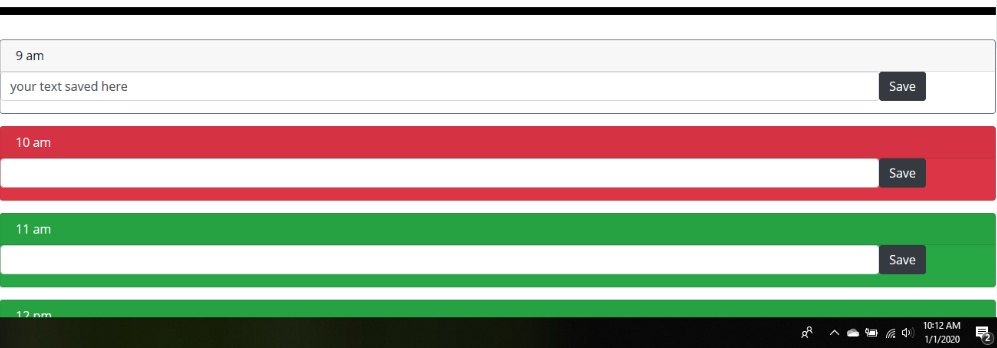
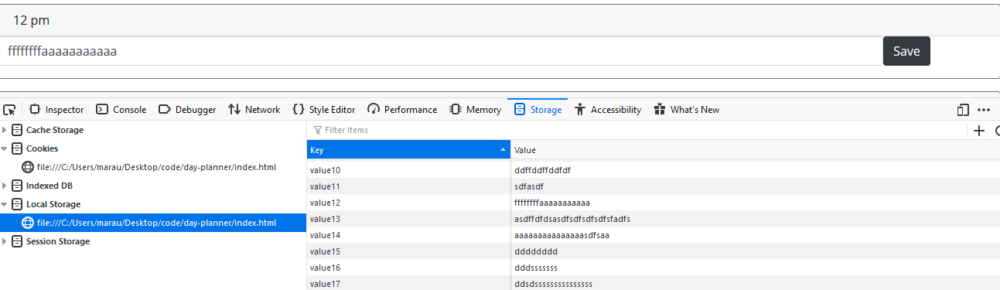
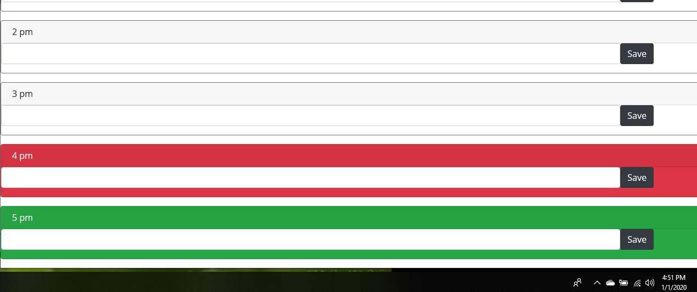

# Day Planner

## About

This application functions as a basic day planner. The objective is to display a series of color-coded time blocks representing the hours in a normal working day. These blocks will display different colors to signify whether the named time is in the past, present or future, and adjusts based on the current time. The user is also able to store a note on each time block by clicking the 'Save' button, which also stores the note in the browser's local storage. These notes can be accessed simply by opening the page again. 

## Screenshots

## Technology

The day planner was built using:

- HTML 
- Bootstrap CSS
- JavaScript
- JQuery

## Link

https://marauder30.github.io/day-planner/

## Author

[Nicholas Koch](https://marauder30.github.io/)